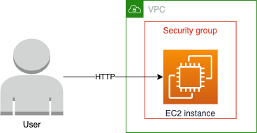
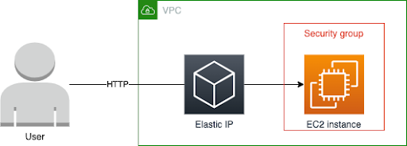
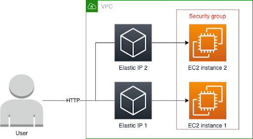
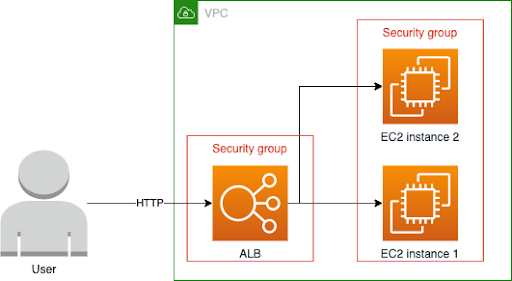

# Terraform workshop

Welcome to the Terraform workshop. In this workshop we will set up a very simple
nginx web server that serves a static page. Some code is already present to get
you started, but you will need to finish it.

Before we get started, you should have received a team name and an AWS access
key from your instructor(s).

## Step 0 - Get this party started

First, we need to make sure you can apply the Terraform code. You will need to
do the following things:

1. Set up your AWS credentials. For this, you can use `aws configure` and use
   `aws sts get-caller-identity` to see you have configured your credentials
   correctly.
2. Copy the `user.auto.tfvars.example` file to `user.auto.tfvars`. We will use
   this file to store some variables specifically for your team. Configure your
   team name here.

You should now be all set. First, run `terraform init` and then `terraform
apply` to create the basic infrastructure.

## Step 1 - Allow inbound traffic

You should now have a single EC2 instance running nginx, which will serve a
simple web page. At this moment, we can not reach it yet. The security group
also does not allow inbound traffic on port 80 yet. Update your infrastructure
in Terraform to make this work.

Related documentation:

* https://registry.terraform.io/providers/hashicorp/aws/latest/docs/resources/security_group_rule

### visual representation:

## Step 2 - Add an elastic IP

Your application is now reachable. We now use the public IP of the EC2
instance. While this works for now, we preferably should not use this IP. If our
EC2 instance ever changes, the IP will change as well.

In order to keep the same IP, we need to create an Elastic IP and attach it to
the EC2 instance.

Hint: you can see the Elastic IP you created by adding an output block.

Related documentation:

* https://registry.terraform.io/providers/hashicorp/aws/latest/docs/resources/eip
* https://registry.terraform.io/providers/hashicorp/aws/latest/docs/resources/eip_association

### visual representation:

## Step 3 - Multiple EC2-instances

Your application is bound to become very popular. We can't expect one EC2
instance to handle all traffic forever. In this step, we are going to add a
second EC2 instance to handle more traffic.

1. Let's make sure there are two EC2 instances. Try to do this without
   duplicating the resource block. We might want to add more instances later.
2. Make sure you add an index or something else to the file created in the user
   data of the EC2 instance. This way you can distinguish the two instances when
   you see the page.
3. You will need an Elastic IP for each EC2 instance. Don't worry about having
   a single entry point for both machines for now. We will add that in the next
   step.

Hint: You can use the `count` and `for_each` meta-attributes to create multiple
instances of a resource.

Hint: changing the user data of an EC2 instance resource has no effect on
existing instances. You can force Terraform to replace an existing resource by
using the `-replace` flag. For instance, you can use `terraform apply
-replace=aws_instance.this`.

Related documentation:

* https://www.terraform.io/language/meta-arguments/count
* https://www.terraform.io/language/meta-arguments/for_each

### visual representation:

## Step 4 - Load balancer

In this part, we are going to add an Application Load Balancer (ALB) to forward
traffic to your EC2 instances.

1. We no longer need the Elastic IPs if we use the load balancer. You can delete
   this resource.
2. We prefer to use a separate security group for the ALB. Create a security
   group with rules that allow ingress from the public internet and egress to
   the EC2 instances.
3. Create a load balancer, a target group and attach the EC2 instances to the
   target group. Add a load balancer listener that forwards all traffic to the
   target group.
4. Add the DNS name of your load balancer to the output to see the URL you can
   visit.
5. Stretch goal: we no longer need to support HTTP directly to the EC2 instance.
   Change the security group to only allow traffic from the EC2 instance.

Hint: You can use the public subnets created by the VPC module with this
expression: `module.vpc.public_subnets`.

Related documentation:

* https://registry.terraform.io/providers/hashicorp/aws/latest/docs/resources/lb
* https://registry.terraform.io/providers/hashicorp/aws/latest/docs/resources/lb_listener
* https://registry.terraform.io/providers/hashicorp/aws/latest/docs/resources/lb_target_group
* https://registry.terraform.io/providers/hashicorp/aws/latest/docs/resources/lb_target_group_attachment

### visual representation:

## Final Step (always end with this step even if you didn't finish all previous steps)

when this lesson is over, remove all generated resources in AWS. You can use `terraform destroy` for that.
